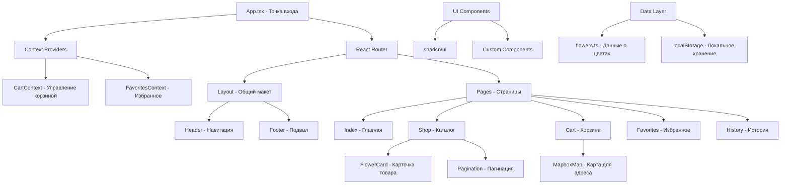

# 🌸 Flower Shop - Интернет-магазин цветов

Современное React-приложение для заказа цветов с интуитивным интерфейсом, корзиной покупок, избранными товарами и интеграцией с картами.

## 📋 Описание проекта

Flower Shop - это полнофункциональный интернет-магазин цветов, построенный с использованием современных веб-технологий. Приложение предоставляет пользователям возможность:

- 🛍️ Просматривать каталог цветов с пагинацией
- ❤️ Добавлять товары в избранное
- 🛒 Управлять корзиной покупок
- 🗺️ Выбирать адрес доставки с помощью интерактивной карты
- 📋 Просматривать историю заказов
- 🔍 Искать и фильтровать товары

## 🏗️ Архитектура проекта



## 🛠️ Технологический стек

### Основные технологии
- **React 18** - UI библиотека
- **TypeScript** - Типизация
- **Vite** - Сборщик и dev-сервер
- **React Router DOM** - Маршрутизация
- **Tailwind CSS** - Стилизация

### UI/UX
- **shadcn/ui** - Компоненты интерфейса
- **Lucide React** - Иконки
- **Radix UI** - Примитивы для UI
- **Class Variance Authority** - Управление вариантами стилей

### Дополнительные библиотеки
- **TanStack Query** - Управление серверным состоянием
- **Mapbox GL** - Интерактивные карты
- **Sonner** - Уведомления
- **React Hook Form** - Работа с формами
- **Zod** - Валидация данных

## 📁 Структура проекта

```
src/
├── components/           # Переиспользуемые компоненты
│   ├── ui/              # UI компоненты (shadcn/ui)
│   ├── layout/          # Компоненты макета
│   │   ├── Header.tsx   # Шапка с навигацией
│   │   ├── Footer.tsx   # Подвал
│   │   └── Layout.tsx   # Общий макет
│   ├── FlowerCard.tsx   # Карточка цветка
│   └── MapboxMap.tsx    # Компонент карты
├── context/             # React Context
│   ├── CartContext.tsx  # Контекст корзины
│   └── FavoritesContext.tsx # Контекст избранного
├── pages/               # Страницы приложения
│   ├── Index.tsx        # Главная страница
│   ├── Shop.tsx         # Страница каталога
│   ├── Cart.tsx         # Страница корзины
│   ├── Favorites.tsx    # Страница избранного
│   ├── History.tsx      # История заказов
│   └── NotFound.tsx     # 404 страница
├── data/                # Данные приложения
│   └── flowers.ts       # Каталог цветов
├── types/               # TypeScript типы
│   └── flower.ts        # Типы для цветов
├── hooks/               # Пользовательские хуки
├── lib/                 # Утилиты
│   └── utils.ts         # Общие утилиты
└── assets/              # Статические ресурсы
    └── *.jpg            # Изображения цветов
```

## 🚀 Установка и запуск

### Предварительные требования
- Node.js версии 18 или выше
- npm или yarn

### Шаги установки

1. **Клонирование репозитория**
   ```bash
   git clone https://github.com/your-username/flower-shop.git
   cd flower-shop
   ```

2. **Установка зависимостей**
   ```bash
   npm install
   # или
   yarn install
   ```

3. **Настройка переменных окружения**
   
   Для работы с картами создайте файл `.env.local`:
   ```env
   VITE_MAPBOX_TOKEN=your_mapbox_public_token_here
   ```
   
   Получить токен Mapbox можно на https://mapbox.com/

4. **Запуск в режиме разработки**
   ```bash
   npm run dev
   # или
   yarn dev
   ```

5. **Сборка для продакшена**
   ```bash
   npm run build
   # или
   yarn build
   ```

6. **Предпросмотр продакшен сборки**
   ```bash
   npm run preview
   # или
   yarn preview
   ```

## 🔧 Доступные команды

| Команда | Описание |
|---------|----------|
| `npm run dev` | Запуск dev-сервера |
| `npm run build` | Сборка для продакшена |
| `npm run preview` | Предпросмотр сборки |
| `npm run lint` | Проверка кода линтером |

## 📱 Основной функционал

### 🛍️ Каталог товаров (Shop)
- Просмотр списка цветов с изображениями
- Пагинация для удобной навигации
- Добавление товаров в корзину и избранное
- Информация о магазине для каждого товара

### ❤️ Избранное (Favorites)
- Сохранение понравившихся товаров
- Сортировка по имени, цене, дате добавления
- Быстрое добавление в корзину
- Локальное сохранение данных

### 🛒 Корзина (Cart)
- Управление количеством товаров
- Расчет общей стоимости
- Выбор адреса доставки на карте
- Оформление заказа

### 🗺️ Интеграция с картами
- Интерактивная карта Mapbox
- Выбор точки доставки
- Автоматическое определение адреса

### 📋 История заказов (History)
- Просмотр всех заказов
- Поиск по email и номеру телефона
- Детальная информация о каждом заказе

## 🎨 Дизайн система

Проект использует современную дизайн-систему с:
- **Цветовая палитра**: Основана на blue/gray тонах
- **Типографика**: Система размеров и весов шрифтов
- **Компоненты**: Консистентные UI элементы
- **Отзывчивость**: Адаптивный дизайн для всех устройств
- **Анимации**: Плавные переходы и микроанимации

## 🔄 Управление состоянием

### Context API
- **CartContext**: Управление корзиной покупок
- **FavoritesContext**: Управление избранными товарами

### Локальное хранение
- Корзина сохраняется в `localStorage`
- Избранное сохраняется в `localStorage`
- История заказов сохраняется в `localStorage`

## 🌐 Маршрутизация

| Путь | Компонент | Описание |
|------|----------|----------|
| `/` | Index | Главная страница |
| `/shop` | Shop | Каталог цветов |
| `/cart` | Cart | Корзина покупок |
| `/favorites` | Favorites | Избранные товары |
| `/history` | History | История заказов |
| `/order/:id` | OrderDetails | Детали заказа |

## 🔮 Планы развития

- [ ] Интеграция с backend API
- [ ] Система аутентификации
- [ ] Платежная система
- [ ] Push-уведомления
- [ ] Мобильное приложение
- [ ] Система отзывов
- [ ] Многоязычность
- [ ] Темная тема

## 🤝 Вклад в проект

1. Форкните проект
2. Создайте ветку для новой функции (`git checkout -b feature/AmazingFeature`)
3. Зафиксируйте изменения (`git commit -m 'Add some AmazingFeature'`)
4. Отправьте в ветку (`git push origin feature/AmazingFeature`)
5. Откройте Pull Request

## 📞 Поддержка

При возникновении вопросов или проблем:
- Создайте Issue в GitHub
- Свяжитесь с командой: info@eliftech.com
- Телефон: +1 302 543 20 12

## 📄 Лицензия

Этот проект лицензирован под MIT License - см. файл [LICENSE](LICENSE) для деталей.

---

**Разработано с ❤️ командой Sevgenberg**
